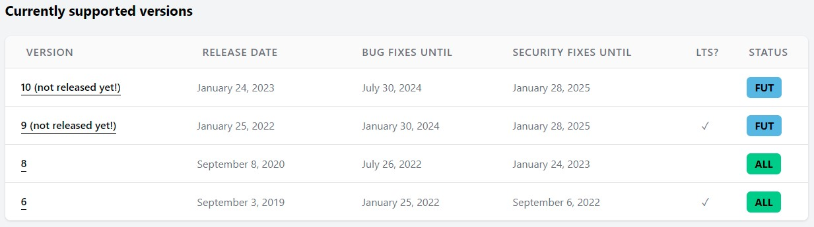

<!-- _class: invert -->
<!-- _paginate: false -->


# Introduction to Laravel 8
New experience and tips about Laravel 8

__
___


## Laravel 8
Laravel 8 rilis pada **8 September 2020**
atau **08-08-2020**.

Sejak rilis, versi sebelumnya perlahan sudah
tidak diupdate lagi

___
### Laravel Version



---
<!-- _class: invert -->

### New Experience
Banyak hal yang diupdate di versi terbaru dari
Laravel 8

---


## How to install Laravel 8
Requirement paling utama adalah versi PHP harus di atas 7.3 atau 8.0 dan composer

---


## Composer
Composer merupakan dependency manager
untuk PHP.
Install `https://getcomposer.org/`

---
<!-- _class: invert -->


## Install Laravel
Via composer
```bash
composer create-project laravel/laravel nama-projek
```

---
<!-- _class: invert -->


## Install Laravel
Via Installer. Install dulu installernya
```bash
composer global require laravel/installer
```

Lalu jalankan
```bash
laravel new nama-projek
```

---


## Set Up Laravel
Untuk setup, yang pertama adalah copy .env file

```bash
cp .env-example .env
```

---

## Set Up Laravel
Generate key

```bash
php artisan key:generate
```

---

## Set Up Laravel
Untuk menjalankannya gunakan perintah

```bash
php artisan serve
```
---
<!-- _class: invert -->

## Let's start

---
## Model and Migration
Model merupakan class yang menghimpun detail tabel database.
Migration merupakan sebuah cara untuk mengelola tabel di database.

---
<!-- _class: invert -->
## Model dan Migration
```bash
php artisan make:model NamaModel
```
```bash
php artisan make:migration nama-migration
```

---
## Controller
Controller merupakan sebuah class yang berisi semua detail fungsi-fungsi sistem. Berfungsi untuk mengatur keseluruhan sistem.

```bash
php artisan make:controller NamaController
```

---
<!-- _class: invert -->
## View
View merupakan sebuah tempat untuk membuat tampilan atau halaman-halaman sistem yang bisa diakses user.
Sayangnya tidak ada command khusus untuk membuat view. Jadi harus buat manual.

---
## Laravel More Command
Akan tetapi kita bisa menginstall Laravel More Command untuk menambahkan command lain.
```bash
composer require theanik/laravel-more-command --dev
```
---
<!-- _class: invert -->

## Laravel More Command
```bash
php artisan make:repository NamaRepository
```
```bash
php artisan make:service NamaService
```
```bash
php artisan make:trait NamaTrait
```
```bash
php artisan make:view folder/namaview
```

---
## Request and Rule
Request merupakan class yang bertugas untuk melakukan validasi input request.
Sedangkan Rule merupakan class yang memiliki tugas untuk melakukan validasi khusus terhadap suatu input request.

---
## Request and Rule
```bash
php artisan make:request NamaRequest
```
```bash
php artisan make:rule NamaRule
```

---
## Alternative ways
Daripada jalanin command satu-satu, coba command ini!

---
<!-- _class: invert -->
## Alternative ways
1. Membuat model sekaligus dengan migrationnya

```bash
php artisan make:model NamaModel -m
```

NamaModel akan otomatis menjadi nama tabel sesuai kaidah penulisan tabel yang benar (kalau b.ing).

---
## Alternative ways
2. Membuat model sekaligus dengan migrationnya, controller dan rekan-rekannya

```bash
php artisan make:model NamaModel -a
```

Nantinya akan membuat model, migration, controller, factory, seeder, request, dan policy.

---
## Alternative ways
3. Membuat model sekaligus beberapa file spesifiknya

```bash
php artisan make:model NamaModel -mcrR
```
```
m -> migration
c -> controller
r -> resource
R -> Request
```


